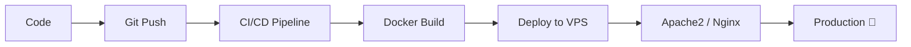

<p align="center">
  
</p>

<p align="center">
  
</p>

---

<h3 align="center">⚡ Data analytics • DevOps • Cloud ⚡</h3>

<p align="center">
  <a href="https://www.linkedin.com/in/manjot-singh-b64b923a7/">
    
  </a>
  <!-- Facebook commented intentionally -->
  <!-- <a href="#"></a> -->
</p>

---

# 👨‍💻 About Me

```yaml
Name: Manjot Singh
Role: DevOps Engineer + Data analytics
Architecture: Scalable & Production Ready
Speciality: Automation + Secure Deployments
Mindset: "You are not failing. You are being trained."
```
---

# 🧠 Technology Stack

<h2 align="center">⚙️ Backend Systems & APIs</h2>

<p align="center">
  
</p>

<br/>

<h2 align="center">🎯 Frontend & UI Architecture</h2>

<p align="center">
  
</p>

## 🗄️ Databases

| Category | Technologies |
|----------|-------------|
| 🟦 SQL | MySQL • PostgreSQL |
| 🟩 NoSQL | MongoDB |
| 🧠 Vector DB | Pinecone • FAISS |
| ⚡ Cache | Redis |

---

# 🌍 Server & Hosting

- Apache2 Server  
- Nginx  
- Shared Hosting Deployment  
- VPS Configuration  
- Linux Administration  
- SSL Installation  
- DNS & Domain Management  

---

# ☁️ Cloud & DevOps

<p>

</p>

- CI/CD Pipelines  
- GitHub Actions  
- Dockerized Applications  
- Kubernetes Basics  
- AWS EC2 / S3  
- AWS Lambda (Serverless Architecture)  
- Log Monitoring  
- Performance Optimization  

---

# 🔁 Dev Workflow



---

# 🔥 Skills


---

# 📊 GitHub Analytics

<p align="center">
  
  
</p>

---

# 📫 Contact

📩 Gmail: manjotsinghsahni1132@gmail.com   
🔗 LinkedIn: www.linkedin.com/in/manjot-singh-b64b923a7

---

# ⚡ Engineering Philosophy

> Automate everything possible.  
> Build scalable systems.  
> Deploy confidently.  
> Keep learning.

---
<p align="center">
  
</p>

<p align="center">
  
</p>

<!-- ================= END ================= -->
